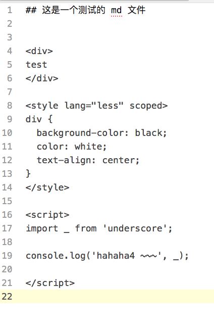
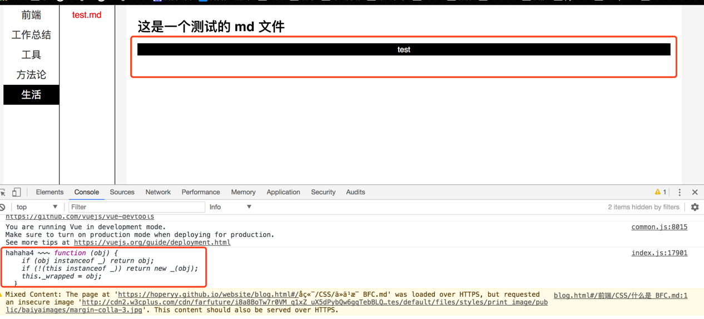

## 简介

+   这是一个脚手架
+   脚手架会将 docs/ 目录下的文件转为网页
+   可以显示多种文件类型
    +   支持 markdown 文档内编写 vue 代码，可以在文章中写各种 demo，并且可以使用第三方包
    +   支持显示各种图片
    +   支持显示各种文件格式的内容

有项目需要写文档的话，请考虑这个工具

## 使用

+ 启动本地调试: `npm run dev`
+ 执行 build：`npm run build`

## 举例

