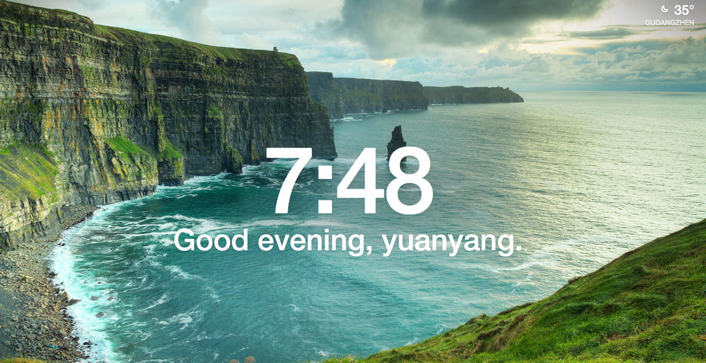

# 这是一个 markdown 文件

+ 可以写 markdown

  就像这个列表项一样

+ 可以用 markdown 语法插入图片，但图片路径不要有中文

  

+ 可以随时插入前端代码

  

  这是一个 div
  

  

+ 可以插入 iframe

  <iframe src="/other.html#/demo"></iframe>

+ 可以随时插入 vue 编写的 demo

<test>test</test>

